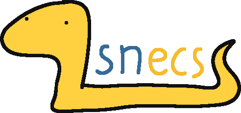

# snecs (work in progress)


<p align="center">

</p>
<h3 align="center">A straightforward, nimble ECS for Python.</h3>

snecs is a pure Python, dependency-free [ECS] library, heavily inspired by
Rust's [Legion], and aiming to be as fast and easy-to-use as possible.

# Contents

- [Overview](#overview)
- Other stuff to come...
- [License](#license)


# Overview

snecs is an [ECS] library, written from the ground up to be:

## Straightforward!

The snecs API is designed to be both easy-to-use, and encourage cleanly
structured code. It follows a simple principle - functions do things, classes
represent things - in an attempt to reduce the incidence of antipatterns
 like [ClassesAsNamespaces].

## Nimble!

snecs is written with a benchmark-driven approach. Every statement in the hot
path is benchmarked against alternative ways to express the same behavior, to
let your code run as fast as you need it to.

One of the design goals is outrunning [esper], and eventually I'll have a
benchmark suite to post here.

## Dependency-free!

snecs has [no dependencies whatsoever], other than Python 3.6 or higher; you 
won't need to worry about deprecation warnings from dependencies, or having to
install systemwide libraries for dependencies to work - because there are none!
Installing snecs is as simple as running: 
```console
$ pip install snecs
```

## Pure Python!
snecs is written entirely in Python. It does not use any modules written in
C or any other language, which means that you don't have to worry about
needing a C compiler if there are no wheels for your platform and
distribution, and that it **works perfectly under PyPy**, and gets the full
benefit of its JIT compiler and optimizations.

## Fully typed!

snecs is checked against a [very aggressive mypy configuration] to catch
bugs and let you fully enjoy the library even when writing type-annotated
code. You won't have to `# type: ignore` any use of snecs.

## Lovingly-commented!

Over a third of the non-blank lines in the `snecs/` directory are comments. If 
you ever need to dive into the code to see how snecs works under the hood, 
they will guide you through the source and explain every workaround, 
optimization, and obscure trick you might find non-obvious.
    
    


# License

snecs is made available under the terms of the Mozilla Public License Version 
2.0, the full text of which is available [here], and included in [LICENSE].
If you have questions about the license, check Mozilla's [MPL FAQ].

[ECS]: https://en.wikipedia.org/wiki/Entity_component_system
[Legion]: https://github.com/TomGillen/legion
[ClassesAsNamespaces]: https://www.youtube.com/watch?v=o9pEzgHorH0
[no dependencies whatsoever]: ./pyproject.toml
[very aggressive mypy configuration]: ./mypy.ini
[esper]: https://github.com/benmoran56/esper
[Quine-McCluskey]: https://en.wikipedia.org/wiki/Quine%E2%80%93McCluskey_algorithm
[here]: https://www.mozilla.org/en-US/MPL/2.0/
[LICENSE]: ./LICENSE
[MPL FAQ]: https://www.mozilla.org/en-US/MPL/2.0/FAQ/
