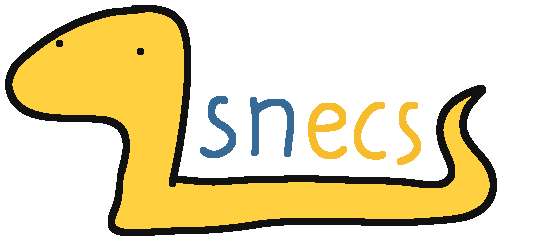

=====
snecs
=====

A straightforward, nimble ECS for Python.
=========================================

.. include:: ../README.rst
   :start-after: teaser-start
   :end-before: teaser-end

Read the :ref:`snecs_changelog`, or scroll down to get started.

Installation
============

``snecs`` is hosted on PyPI_; you can install it the same way as any
PyPI_ package.
Depending on the dependency manager you're using for your project [1]_:

pip_:

.. code-block:: console

   $ pip install snecs

Pipenv_:

.. code-block:: console

   $ pipenv install snecs

Poetry_:

.. code-block:: console

   $ poetry add snecs

.. _PyPI: https://pypi.org/project/snecs
.. _pip: https://pip.pypa.io/en/stable/
.. _Poetry: https://python-poetry.org/
.. _Pipenv: https://pipenv.pypa.io/en/latest/

========
Overview
========

The main part of this documentation is :ref:`a_guided_tour_of_snecs`, which is
structured into sections of increasing technical detail. It's written
manually, and intended as a gentle introduction to the library and
underlying design pattern that doesn't require or presume familiarity with the
core concepts.

The guided tour is supplemented by the :ref:`api_reference`, generated from
the source code docstrings.

To start learning how to use ``snecs``:

- If you're not familiar with Entity-Component-Systems, the :ref:`ECS` page
  provides a quick explanation of the design pattern.
- When you're ready to start developing with ``snecs``, read
  :ref:`getting_started`. It's a high-level explanation of the library,
  detailing the general flow of working with it.
- You can find the full documentation of all the names that are part of the
  ``snecs`` public API in :ref:`api_reference`.

Full Table of Contents
======================

.. toctree::
   :maxdepth: 1

   license_credits
   changelog

.. toctree::
   :maxdepth: 2

   guided_tour

.. toctree::
   :maxdepth: 1

   api

Indices and tables
==================

* :ref:`genindex`
* :ref:`modindex`
* :ref:`search`

.. rubric:: Footnotes

.. [1]

    I highly recommend Poetry. It offers a very pleasant development
    experience, and makes it effortless to manage dependencies, and your
    entire project.

    Regardless of which tool you're using, I recommend installing ``snecs``
    and other Python packages in a `virtual environment`_. Poetry and Pipenv
    handle that for you!

.. _virtual environment: https://packaging.python.org/guides/installing-using-pip-and-virtual-environments/
